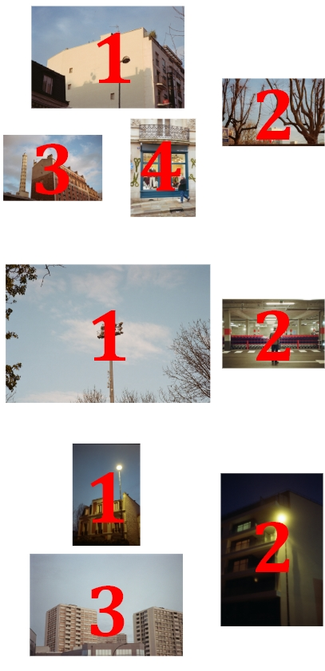

# Photo Website

## Introduction

2020 lockdown  project for a basic full front Angular photography website.  
Website should contain a home page ( content tbd), collection pages, shop page, contact/ about pages.

##Collection layout generation

The collections are parsed from a JSON file (Collections.json) saved in the assets.
Current datas used from this JSON : 

```json
   "collection":[
     {
       "name": "The Name of your Collection. This will be the url and the navbar title",
       "titre": "Title of the collection. This will be appearing at the top of your collection",
       "files": ["example1.jpg","example2.jpg"] name of your picture files
     }
```

In the navbar, all the collection.name will be listed and will give you access to their own page.  
The collection.titre will be apprearing at the top of the collection page.  
The pictures listed in collection.files will be opened on the collection page, if they are correctly stored at assets/Photos/collection.name/collection.files.  

Layout if the pictures is generated dynamically on the client side, when opening the page. Performance seems ok, but I'll need to test that more intensively later. It has no database tho!

Example of layout Depending on how many pictures there is in collection.files:



As a rule of thumb, I tired to make the layout various enough to be not too dull, and look at the orientation of the pic to favor the good position of pics depending of there layout.  
For more details about how layout is generated, you can look at  initPhotoLayout() 
in the collection.component.ts file. That's was the fun part.

This project was generated with [Angular CLI](https://github.com/angular/angular-cli) version 9.1.0.

##Disclaimer

This project is very Wip-y , for a training purpose more than anything else.  
There is many better ways to do photography website. 

## Development server

Run `ng serve` for a dev server. Navigate to `http://localhost:4200/`. The app will automatically reload if you change any of the source files.

## Build

Run `ng build` to build the project. The build artifacts will be stored in the `dist/` directory. Use the `--prod` flag for a production build.
 to execute the end-to-end tests via [Protractor](http://www.protractortest.org/).
